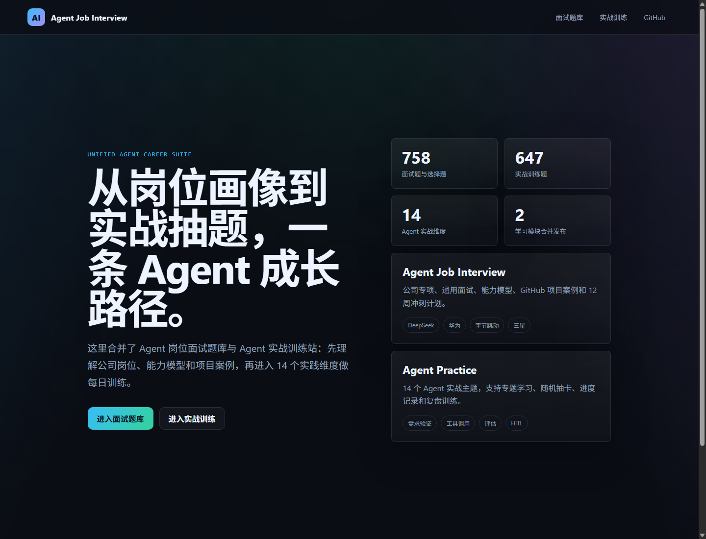
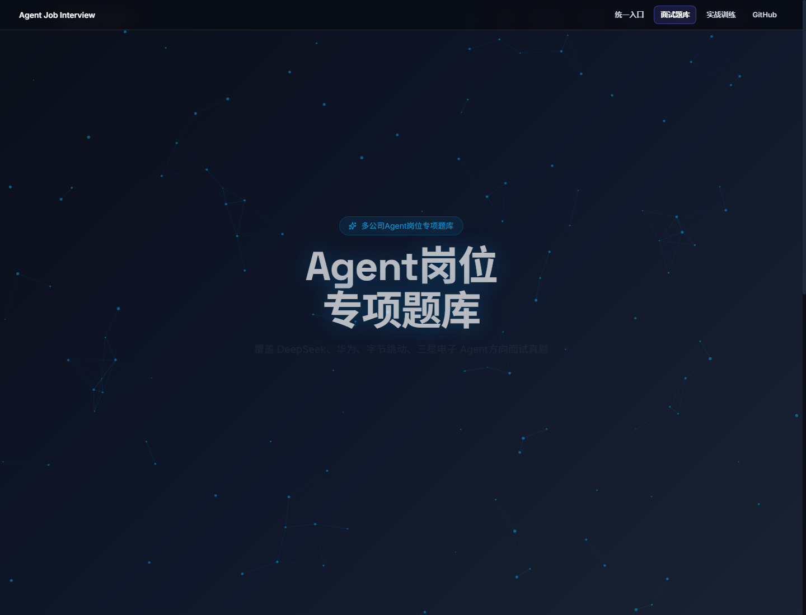
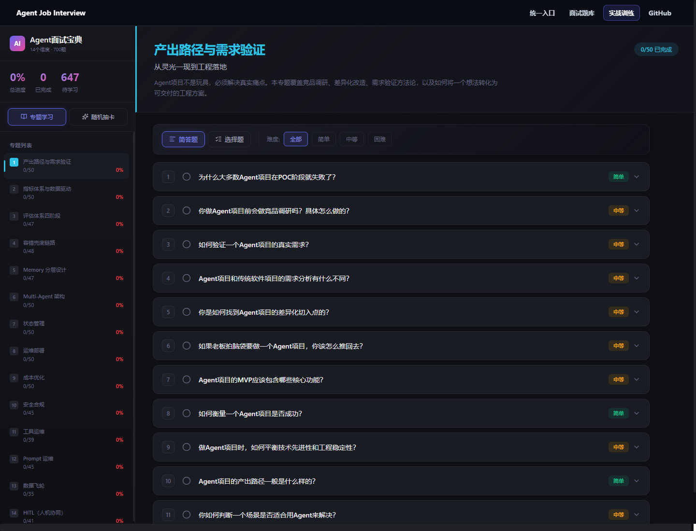
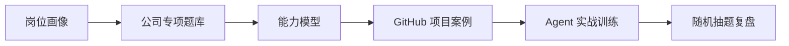

<div align="center">
  <h1>Agent Job Interview</h1>
  <p><strong>Agent 岗位面试题库 + Agent 实战训练路线，一个仓库、一个 GitHub Pages。</strong></p>
  <p>
    <a href="https://harzva.github.io/Agent-Job-Interview/"><strong>打开统一首页</strong></a>
    ·
    <a href="https://harzva.github.io/Agent-Job-Interview/interview/">面试题库</a>
    ·
    <a href="https://harzva.github.io/Agent-Job-Interview/practice/">实战训练</a>
  </p>
  <p>
    
    
    
    
    
  </p>
</div>

<p align="center">
  <a href="https://harzva.github.io/Agent-Job-Interview/">
    
  </a>
</p>

## 项目定位

这个仓库把两个原本独立的项目合并成一条完整的 Agent 成长路线：

| 模块 | 用途 | 在线入口 |
| --- | --- | --- |
| 面试题库 | 按公司、能力模型、项目案例组织 Agent 岗位准备材料 | [`/interview/`](https://harzva.github.io/Agent-Job-Interview/interview/) |
| 实战训练 | 14 个 Agent 实战主题，支持专题学习、随机抽卡、进度记录 | [`/practice/`](https://harzva.github.io/Agent-Job-Interview/practice/) |

更推荐的使用方式是：先用面试题库建立岗位画像和能力差距，再用实战训练把问题拆成每天可以复盘的练习。

## 页面预览

<table>
  <tr>
    <td width="50%">
      <a href="https://harzva.github.io/Agent-Job-Interview/interview/">
        
      </a>
      <br>
      <strong>面试题库</strong>
      <br>
      公司专项、通用面试、能力模型、GitHub 项目案例和学习路径集中在一个页面中。
    </td>
    <td width="50%">
      <a href="https://harzva.github.io/Agent-Job-Interview/practice/">
        
      </a>
      <br>
      <strong>实战训练</strong>
      <br>
      从需求验证、工具调用、评估、HITL 到运维部署，按专题拆成可练习题目。
    </td>
  </tr>
</table>

## 内容规模

| 内容 | 数量 | 说明 |
| --- | ---: | --- |
| 面试与选择题 | 758 | 覆盖岗位理解、工程实现、数据策略、系统设计、行为面试等方向 |
| 实战训练题 | 647 | 分布在 14 个 Agent 实战主题中 |
| 公司专项 | 4 | DeepSeek、华为、字节跳动、三星等方向 |
| GitHub 项目案例 | 13 | 用项目复盘连接题目训练和真实作品 |

## 合并来源

| 原仓库 | 来源版本 | 合并后位置 |
| --- | --- | --- |
| `Harzva/agent-job-interview-roadmap` | `8cf6d28` | `apps/interview/` 与 `docs/interview/` |
| `Harzva/kimi-agent-practice-roadmap` | `4c4c4d1` | `apps/practice/` 与 `docs/practice/` |

`Harzva/kimi-agent-practice-roadmap` 目前保留为历史入口，README 和 Pages 已指向新的实战训练页面。

## 学习路径



## 项目结构

```text
.
├─ assets/readme/          # README 页面预览截图
├─ docs/                   # GitHub Pages 发布目录
│  ├─ index.html           # 统一首页
│  ├─ interview/           # 面试题库静态站
│  └─ practice/            # 实战训练静态站
├─ apps/
│  ├─ interview/           # 面试题库 React + Vite 源码
│  └─ practice/            # 实战训练 React + Vite 源码
└─ README.md
```

## 本地开发

两个子应用仍然可以独立开发。

```powershell
cd apps/interview
npm install
node .\node_modules\typescript\bin\tsc -b
node .\node_modules\vite\bin\vite.js build
```

```powershell
cd apps/practice
npm install
node .\node_modules\typescript\bin\tsc -b
node .\node_modules\vite\bin\vite.js build
```

构建后把各自的 `dist/` 同步到：

- `docs/interview/`
- `docs/practice/`

## 发布说明

GitHub Pages 使用 `main` 分支的 `/docs` 目录。两个子应用都使用相对资源路径，适配项目页子路径部署。

> `practice` 模块的数据请求必须保持为 `./topics.json`；改成 `/topics.json` 会在 GitHub Pages 子路径下加载失败，页面会停在“加载中”。

## 维护策略

- 新内容优先进入对应子应用源码，再同步静态产物到 `docs/`。
- README 截图放在 `assets/readme/`，用于让 GitHub 仓库首页直接展示网页效果。
- 题库与训练内容用于学习和模拟，不代表任何公司官方面试题。
